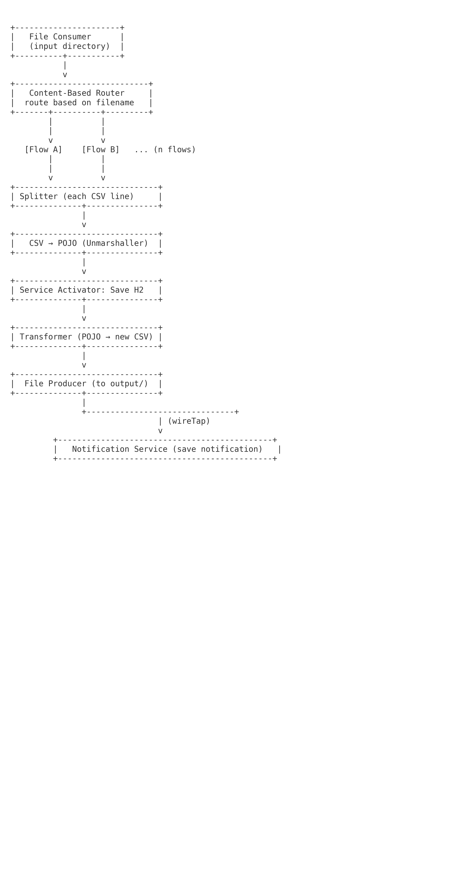

✅ Objective

1. Monitor an input/ directory

2. Detect CSV files

3. Automatically select a flow based on the file name

4. Parse the CSV file (different formats depending on the flow)

5. Save to a database

6. Convert the content to another CSV format

7. Place the new file in an output/ directory

8. Insert into a notification table

9. All while respecting the EIPs

---

🧩 The EIP used

| Besoin                        | Pattern EIP                                    | Description                        |
| ----------------------------- | ---------------------------------------------- | ---------------------------------- |
| Surveiller un répertoire      | **File Consumer**                              | Surveillance d'un répertoire       |
| Détecter le type du fichier   | **Content-Based Router**                       | Router selon le nom du fichier     |
| Parser un fichier             | **Splitter** + **Unmarshaller**                | Split CSV en lignes + parser       |
| Sauvegarder en base           | **Message Translator** / **Service Activator** | Appel des services Spring          |
| Transformer vers autre format | **Transformer**                                | Mapper record → nouvelle structure |
| Écrire dans /output           | **File Producer**                              | Production d'un fichier            |
| Enregistrer une notification  | **WireTap** ou **Poison Message Channel**      | Traitement secondaire sans bloquer |

---

🏗️ EIP Architecture (diagram)



---

🧱 Implementation with Apache Camel: Project Structure

```<!DOCTYPE html>
<html lang="fr">
<head>
  <meta charset="UTF-8">
  <title>EIP Architecture</title>
  <script src="https://cdn.tailwindcss.com"></script>
</head>

<body class="min-h-screen bg-gradient-to-br from-slate-900 via-blue-900 to-slate-900 text-white p-8">
  <div class="max-w-7xl mx-auto">

    <!-- Header -->
    <div class="text-center mb-12">
      <h1 class="text-4xl font-bold mb-4 bg-gradient-to-r from-blue-400 to-purple-400 bg-clip-text text-transparent">
        Architecture EIP avec Apache Camel
      </h1>
      <p class="text-slate-300 text-lg">
        Traitement automatisé de fichiers CSV avec Enterprise Integration Patterns
      </p>
    </div>

    <!-- Patterns Grid -->
    <div class="grid md:grid-cols-2 lg:grid-cols-3 gap-6 mb-12">

      <!-- Pattern items -->
      <div class="bg-slate-800/50 backdrop-blur-sm rounded-xl p-6 border border-slate-700 hover:border-slate-500 transition-all">
        <div class="bg-blue-500 w-12 h-12 rounded-lg mb-4"></div>
        <h3 class="text-xl font-semibold mb-2">File Polling Consumer</h3>
        <p class="text-slate-400 text-sm">Surveille le répertoire input</p>
      </div>

      <div class="bg-slate-800/50 backdrop-blur-sm rounded-xl p-6 border border-slate-700 hover:border-slate-500 transition-all">
        <div class="bg-purple-500 w-12 h-12 rounded-lg mb-4"></div>
        <h3 class="text-xl font-semibold mb-2">Content-Based Router</h3>
        <p class="text-slate-400 text-sm">Route selon le nom du fichier</p>
      </div>

      <div class="bg-slate-800/50 backdrop-blur-sm rounded-xl p-6 border border-slate-700 hover:border-slate-500 transition-all">
        <div class="bg-green-500 w-12 h-12 rounded-lg mb-4"></div>
        <h3 class="text-xl font-semibold mb-2">Message Translator</h3>
        <p class="text-slate-400 text-sm">Parse et transforme les CSV</p>
      </div>

      <div class="bg-slate-800/50 backdrop-blur-sm rounded-xl p-6 border border-slate-700 hover:border-slate-500 transition-all">
        <div class="bg-yellow-500 w-12 h-12 rounded-lg mb-4"></div>
        <h3 class="text-xl font-semibold mb-2">Message Filter</h3>
        <p class="text-slate-400 text-sm">Filtre les records invalides</p>
      </div>

      <div class="bg-slate-800/50 backdrop-blur-sm rounded-xl p-6 border border-slate-700 hover:border-slate-500 transition-all">
        <div class="bg-red-500 w-12 h-12 rounded-lg mb-4"></div>
        <h3 class="text-xl font-semibold mb-2">Wire Tap</h3>
        <p class="text-slate-400 text-sm">Sauvegarde en base H2</p>
      </div>

      <div class="bg-slate-800/50 backdrop-blur-sm rounded-xl p-6 border border-slate-700 hover:border-slate-500 transition-all">
        <div class="bg-orange-500 w-12 h-12 rounded-lg mb-4"></div>
        <h3 class="text-xl font-semibold mb-2">Dead Letter Channel</h3>
        <p class="text-slate-400 text-sm">Gestion des erreurs</p>
      </div>
    </div>

    <!-- Flow -->
    <div class="bg-slate-800/50 backdrop-blur-sm rounded-xl p-8 border border-slate-700 mb-12">
      <h2 class="text-2xl font-bold mb-6 flex items-center gap-2">
        <span class="text-blue-400">→</span> Flow de traitement
      </h2>

      <div class="flex flex-wrap items-center justify-center gap-4">

        <!-- Step -->
        <div class="flex flex-col items-center">
          <div class="bg-gradient-to-br from-blue-500 to-purple-600 w-16 h-16 rounded-full flex items-center justify-center text-2xl font-bold mb-2">1</div>
          <div class="text-center">
            <div class="font-semibold text-sm">Polling</div>
            <div class="text-slate-400 text-xs">Surveille input/</div>
          </div>
        </div>

        <span class="text-slate-500 hidden sm:block">→</span>

        <div class="flex flex-col items-center">
          <div class="bg-gradient-to-br from-blue-500 to-purple-600 w-16 h-16 rounded-full flex items-center justify-center text-2xl font-bold mb-2">2</div>
          <div class="text-center">
            <div class="font-semibold text-sm">Routing</div>
            <div class="text-slate-400 text-xs">Détecte le flow</div>
          </div>
        </div>

        <span class="text-slate-500 hidden sm:block">→</span>

        <div class="flex flex-col items-center">
          <div class="bg-gradient-to-br from-blue-500 to-purple-600 w-16 h-16 rounded-full flex items-center justify-center text-2xl font-bold mb-2">3</div>
          <div class="text-center">
            <div class="font-semibold text-sm">Parsing</div>
            <div class="text-slate-400 text-xs">Parse CSV</div>
          </div>
        </div>

        <span class="text-slate-500 hidden sm:block">→</span>

        <div class="flex flex-col items-center">
          <div class="bg-gradient-to-br from-blue-500 to-purple-600 w-16 h-16 rounded-full flex items-center justify-center text-2xl font-bold mb-2">4</div>
          <div class="text-center">
            <div class="font-semibold text-sm">Persistence</div>
            <div class="text-slate-400 text-xs">Save H2</div>
          </div>
        </div>

        <span class="text-slate-500 hidden sm:block">→</span>

        <div class="flex flex-col items-center">
          <div class="bg-gradient-to-br from-blue-500 to-purple-600 w-16 h-16 rounded-full flex items-center justify-center text-2xl font-bold mb-2">5</div>
          <div class="text-center">
            <div class="font-semibold text-sm">Transform</div>
            <div class="text-slate-400 text-xs">Convert format</div>
          </div>
        </div>

        <span class="text-slate-500 hidden sm:block">→</span>

        <div class="flex flex-col items-center">
          <div class="bg-gradient-to-br from-blue-500 to-purple-600 w-16 h-16 rounded-full flex items-center justify-center text-2xl font-bold mb-2">6</div>
          <div class="text-center">
            <div class="font-semibold text-sm">Output</div>
            <div class="text-slate-400 text-xs">Dépose output/</div>
          </div>
        </div>

        <span class="text-slate-500 hidden sm:block">→</span>

        <div class="flex flex-col items-center">
          <div class="bg-gradient-to-br from-blue-500 to-purple-600 w-16 h-16 rounded-full flex items-center justify-center text-2xl font-bold mb-2">7</div>
          <div class="text-center">
            <div class="font-semibold text-sm">Notify</div>
            <div class="text-slate-400 text-xs">Log notification</div>
          </div>
        </div>

      </div>
    </div>

    <!-- Patterns Summary -->
    <div class="bg-gradient-to-r from-blue-600/20 to-purple-600/20 backdrop-blur-sm rounded-xl p-6 border border-blue-500/30">
      <h3 class="text-xl font-semibold mb-3 flex items-center gap-2">
        <span class="text-yellow-400">🔔</span> Patterns EIP utilisés
      </h3>

      <ul class="space-y-2 text-slate-300">
        <li><span class="text-blue-400 font-bold">•</span> <strong>Polling Consumer:</strong> Surveillance continue du répertoire input</li>
        <li><span class="text-blue-400 font-bold">•</span> <strong>Content-Based Router:</strong> Routage dynamique selon le nom du fichier</li>
        <li><span class="text-blue-400 font-bold">•</span> <strong>Message Translator:</strong> Transformation CSV vers objets</li>
        <li><span class="text-blue-400 font-bold">•</span> <strong>Wire Tap:</strong> Copie du message pour sauvegarde</li>
        <li><span class="text-blue-400 font-bold">•</span> <strong>Dead Letter Channel:</strong> Gestion des erreurs</li>
        <li><span class="text-blue-400 font-bold">•</span> <strong>Message Filter:</strong> Filtrage des records invalides</li>
      </ul>
    </div>

  </div>
</body>
</html>
