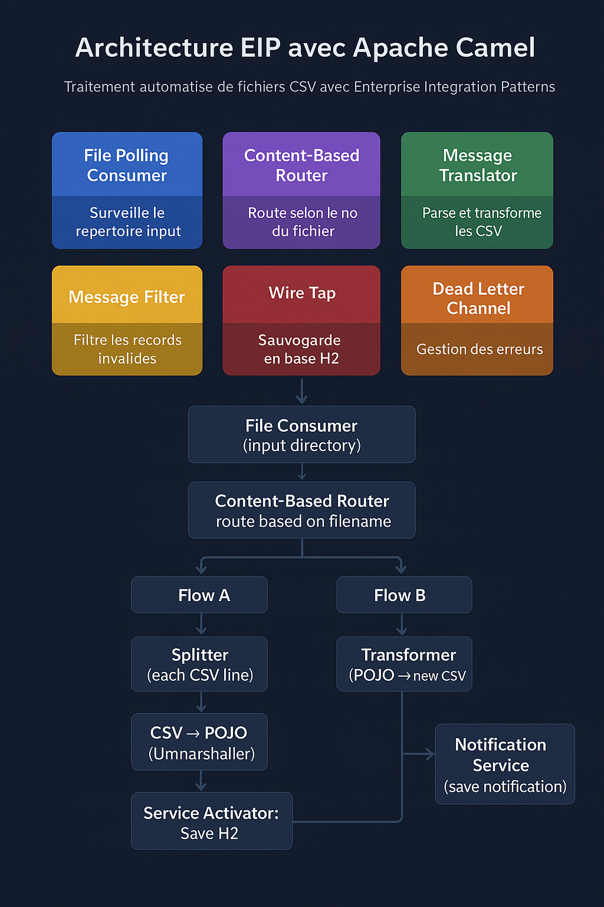

✅ Objective

1. Monitor an input/ directory

2. Detect CSV files

3. Automatically select a flow based on the file name

4. Parse the CSV file (different formats depending on the flow)

5. Save to a database

6. Convert the content to another CSV format

7. Place the new file in an output/ directory

8. Insert into a notification table

9. All while respecting the EIPs

---

🧩 The EIP used

| Besoin                        | Pattern EIP                                    | Description                        |
| ----------------------------- | ---------------------------------------------- | ---------------------------------- |
| Surveiller un répertoire      | **File Consumer**                              | Surveillance d'un répertoire       |
| Détecter le type du fichier   | **Content-Based Router**                       | Router selon le nom du fichier     |
| Parser un fichier             | **Splitter** + **Unmarshaller**                | Split CSV en lignes + parser       |
| Sauvegarder en base           | **Message Translator** / **Service Activator** | Appel des services Spring          |
| Transformer vers autre format | **Transformer**                                | Mapper record → nouvelle structure |
| Écrire dans /output           | **File Producer**                              | Production d'un fichier            |
| Enregistrer une notification  | **WireTap** ou **Poison Message Channel**      | Traitement secondaire sans bloquer |

---

🏗️ EIP Architecture (diagram)

---

🧱 Implementation with Apache Camel: Project Structure

